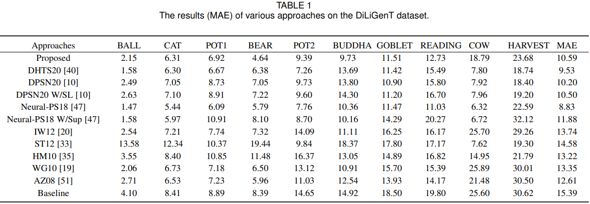

# Non-Lambertian-Photometric-Stereo-via-Lambertian-Points
李逊 西北工业大学 硕士
# Non-Lambertian-Photometric-Stereo-via-Lambertian-Points
Traditional method based on Outlier Rejection. The code and data are coming soon.
We also create a new photometric stereo dataset which is constructed with much simple devices, i.e., a mobile phone and a flashlight. 
# Normal and depth

# Compared with other traditional methods

